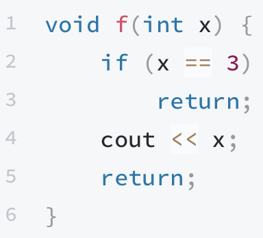

# 函數 \(Function\)

在程式裡面，如果要在不同地方執行多次相同程式，或是縮短程式運算式，都可以運用函數幫助我們解決。請看範例：

> 題目：
>
> 給定兩數字a, b
>
> 請輸出較大的數字、兩數和、兩數乘積及a-b

```cpp
#include <iostream>
using namespace std;

void print(int i, int j) {
    if (i > j) {
        cout << i << endl;
    } else {
        cout << j << endl;
    }
    cout << i + j << endl;
    cout << i * j << endl;
    cout << i - j << endl;
}

int main() {
    int a, b;
    cin >> a >> b;
    print(a, b);
    return 0;
}
```

> 範例輸入：
>
> 3 9

> 範例輸出：
>
> 9
>
> 12
>
> 37
>
> -6

程式中的`print()`就是剛剛所說的函數，在主程式`main()`中，並沒有直接輸出，反而去執行`print(a, b);`，所以真正在輸出最大值的地方是在`print`函數，這樣寫的好處就是如果我要執行一堆瑣碎的動作，可以將它們包裝成一塊大動作，每次呼叫就執行全部的動作。

詳細宣告方法如下：

```cpp
[(A)回傳變數型態] [(B)函數名稱]((C)參數1, 2 ... n) {
    ...
    return [(D)回傳項目];
}
```

在數學中的 $$f(x)$$ 其實就是一種函數，如果$$f(x) = x * x , x ∈ Z$$ ，在程式裡面可以這樣寫：

```cpp
int f(int x) {
    return x * x;
}
int main() {
    cout << f(6);
    return 0;
}
//輸出： 36
```

1. `int`就是A部分，代表了函數回傳的型態，也可以使用`char`、`float`、`double`、`bool`等資料型態，當然也可以回傳structure！
2. f是函數名稱，是呼叫函數時使用的名稱。
3. `(int x)`是C部分，可以傳入各種參數，如果要傳入多個參數，則需用「`,`」分開，如：`int f(int x, int y, char z) { ... }`
4. `return`這裡很重要，函數裡面可能會有一堆程式碼，使編譯器會不知道要回傳哪一個東西。所以我們需要透過`return`加上回傳項目，才可以回傳我們要的東西。如果在函數中間就遇到`return`，那就會直接回傳並且結束這個函數。如： 


如果回傳型態為`void`，則`return;`代表跳出函數，後面不需要加上任何東西。  
`void`代表虛無，所以此函數不需回傳任何數值。



這裏還有一點非常重要，在函數裡面更改的值，不會影響到丟進來的參數本身，例如：

`void f(int x, int y) {  
    x = 1;  
    y = 2;  
}  
int main() {  
    int x, y;  
    x = 5;  
    y = 6;  
    f(x, y);  
    cout << x << ' ' << y;  
    return 0;  
}`

這裡的輸出仍是`5 6`，不會變成`1 2`。

詳細原因請參照 [全域/區域變數](https://funprogramming.org/50-What-are-global-and-local-variables.html)。



其實每個程式的`main`也是一種函數，其回傳的int值會回傳到呼叫此C++程式的地方，一般來說就是作業系統。



