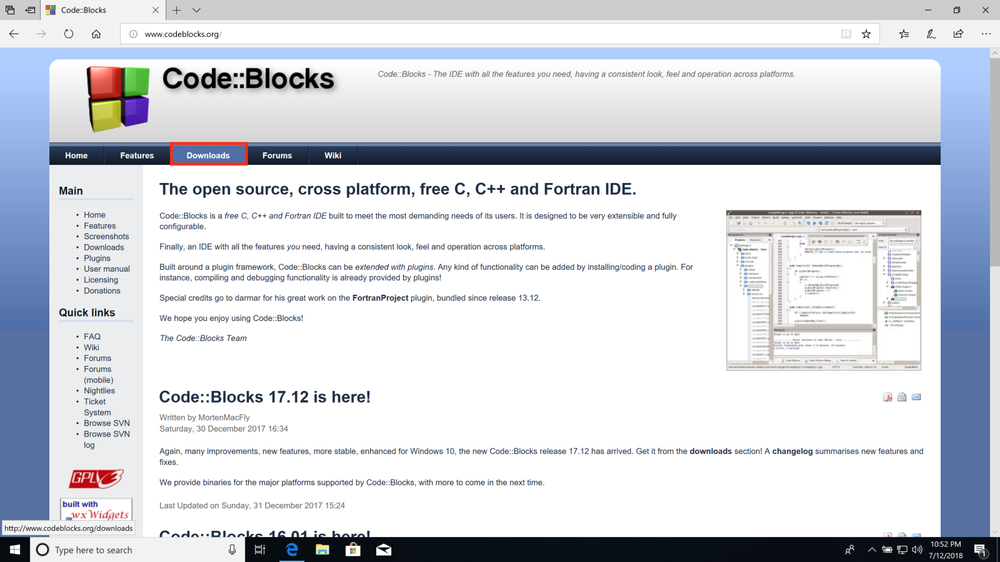
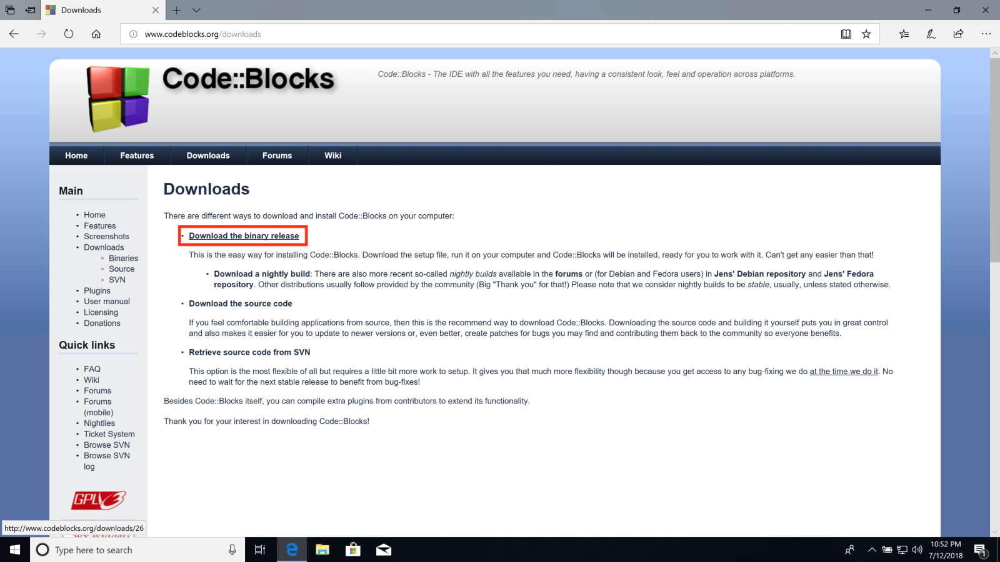
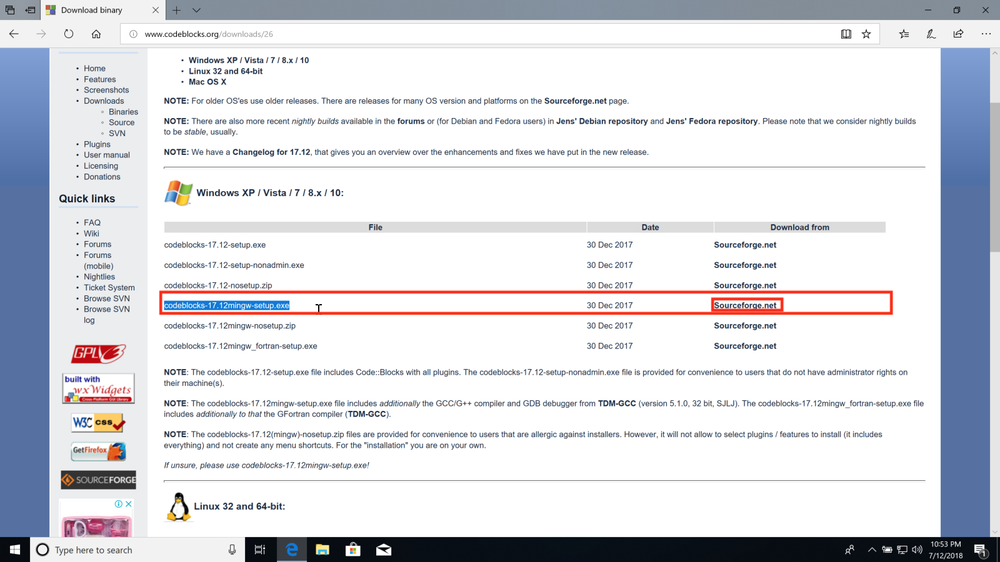
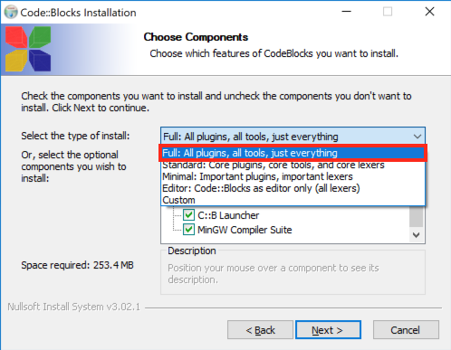
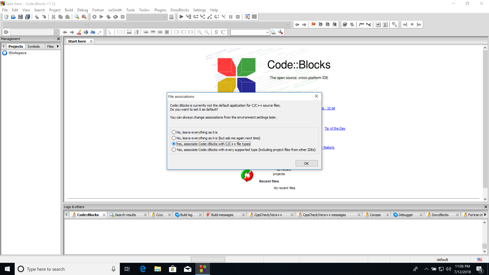
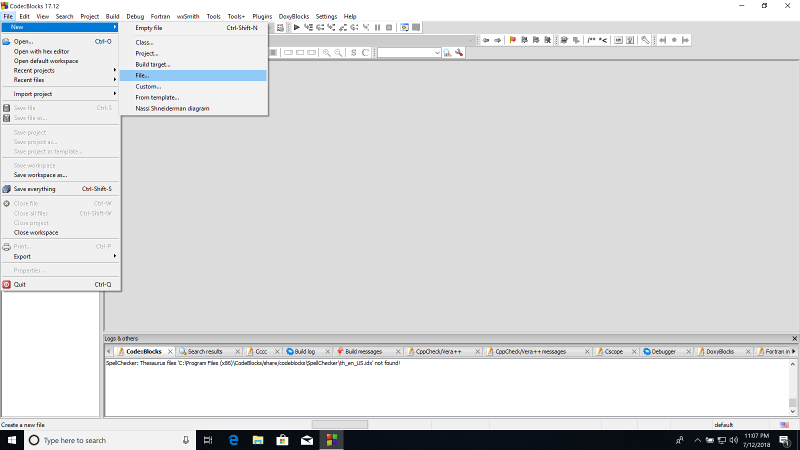
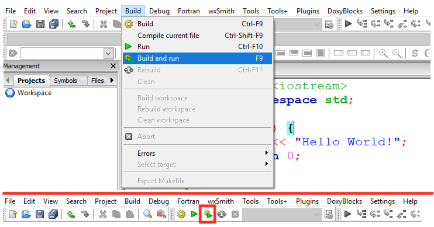
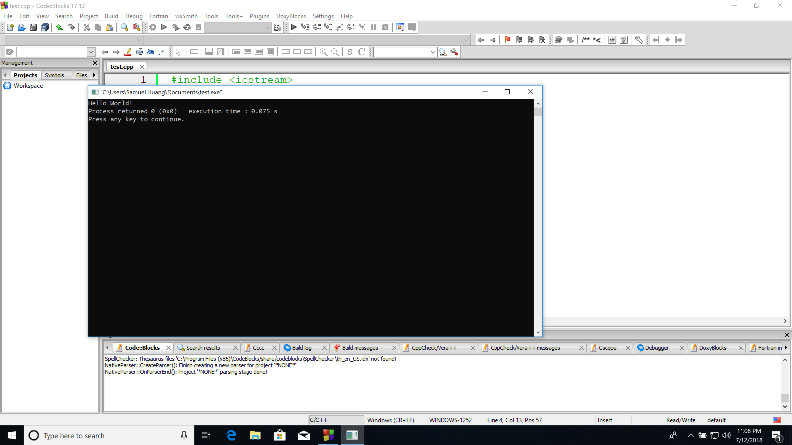

# 環境配置

這裡會介紹如何安裝IDE\(_Integrated Development Environment_\)，它結合了記事本的純文字編輯功能、編譯器及自動執行等功能。這裡將以Windows 10 April 2018 Update版本的作業系統示範：

先到[Code::Blocks](http://www.codeblocks.org)的網站，點選Downloads

選擇Download the binary release 

接著這裡很重要，要記得安裝mingw版本，否則安裝之後只能編輯程式碼，不能編譯和執行程式，點擊Sourceforge.net到下載網頁

下載完之後請執行安裝檔，記得到以下畫面的時候要選擇**Full**選項

安裝完開啟Code::Blocks的時候若看到以下畫面，可以選擇第三個選項，設定c++檔案的預設編輯器為Code::Blocks

接下來點選File-&gt;New-&gt;File...來新增檔案

檔案類型選擇**C/C++ source**

到以下畫面時請選擇**C++**

然後點擊「**...**」按鈕

打上此程式的檔名


這裡的檔案名稱副檔名必需設定為**cpp**，如上圖的「**.cpp**」


打上程式碼之後，選擇Build-&gt;Build and run / 圖片下方的齒輪＋執行按鈕 / F9以編譯加執行程式

執行結果如下

